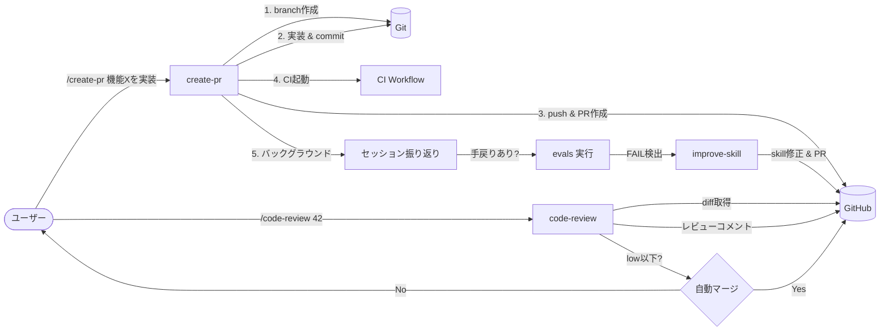
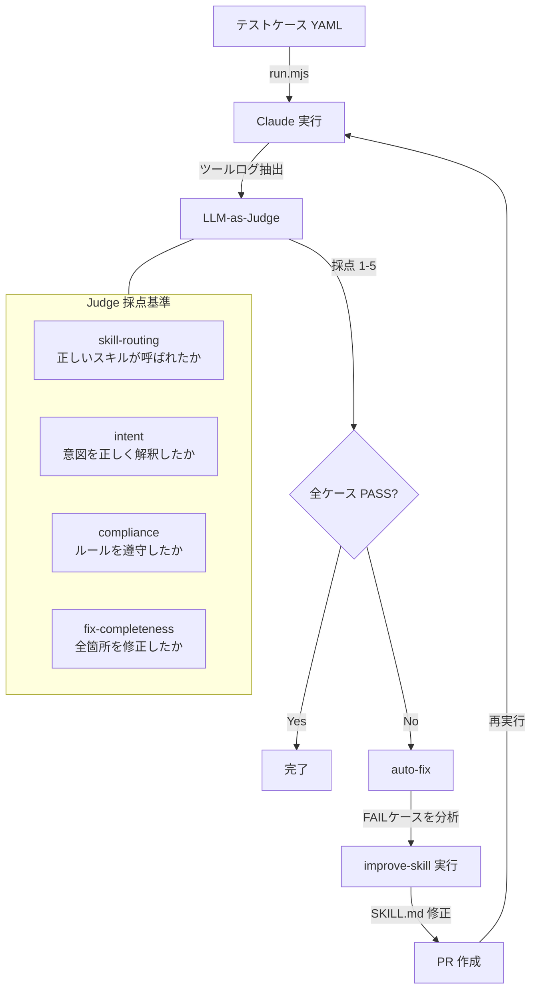
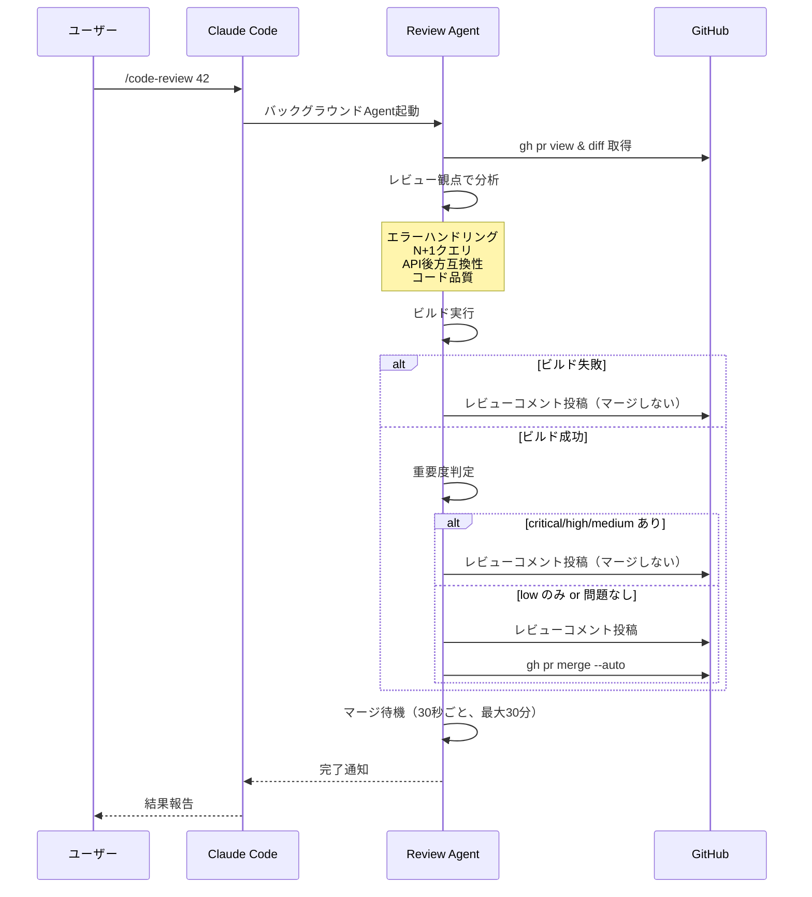
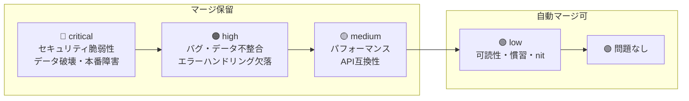

# Engineering using claude for me

プロジェクト横断で再利用可能な Claude Code 設定・スキル・評価基盤。

## 全体像

```mermaid
graph TB
    subgraph engineering["engineering/.claude（共通）"]
        PG[prompt-guide]
        CR[code-review]
        CP[create-pr]
        IS[improve-skill]
        WR[weekly-review]
        EV[evals基盤]
        HK[hooks テンプレート]
    end

    subgraph projectA["Project A .claude/"]
        direction TB
        A_CR[code-review<br/>REPO=owner/a]
        A_CP[create-pr<br/>REPO=owner/a]
        A_IS[improve-skill]
        A_EV[evals + cases/]
        A_DOMAIN[domain skills<br/>api, db, auth...]
        A_HK[hooks<br/>prettier, eslint]
    end

    subgraph projectB["Project B .claude/"]
        direction TB
        B_CR[code-review<br/>REPO=owner/b]
        B_CP[create-pr<br/>REPO=owner/b]
        B_IS[improve-skill]
        B_EV[evals + cases/]
        B_DOMAIN[domain skills<br/>pipeline, infra...]
        B_HK[hooks<br/>cargo fmt, clippy]
    end

    CR -->|コピー & 変数置換| A_CR
    CR -->|コピー & 変数置換| B_CR
    CP -->|コピー & 変数置換| A_CP
    CP -->|コピー & 変数置換| B_CP
    IS --> A_IS
    IS --> B_IS
    EV -->|基盤コピー| A_EV
    EV -->|基盤コピー| B_EV
    HK -->|テンプレ適用| A_HK
    HK -->|テンプレ適用| B_HK
    PG -->|そのまま| A_CR
    PG -->|そのまま| B_CR
```



## スキル間の連携フロー



## 評価 → 自己改善サイクル



## コードレビューフロー



## 重要度フラグ



## 使い方

各プロジェクトの `.claude/` から、必要なスキルやファイルをコピーして `{{変数}}` を置換する。

```bash
# 例: engineering repo から chat repo にスキルをコピー
cp -r ../engineering/.claude/skills/code-review .claude/skills/

# 例: シンボリックリンク（prompt-guide など変数なしのスキル向き）
ln -s ../../../engineering/.claude/skills/prompt-guide .claude/skills/prompt-guide
```

## Directory Structure

```
.claude/
├── README.md                  — このファイル
├── skills/                    — 汎用スキル
│   ├── prompt-guide/SKILL.md  — Claude 4.x プロンプトエンジニアリングガイド
│   ├── code-review/SKILL.md   — PRコードレビュー（Agent別セッション実行、自動マージ判定）
│   ├── create-pr/SKILL.md     — ブランチ & プルリクエスト作成フロー
│   ├── improve-skill/SKILL.md — フィードバックによる自己改善
│   └── weekly-review/SKILL.md — 定期メッセージ分析 & Issue 起票
├── evals/                     — 設定品質の評価基盤
│   ├── run.mjs                — テストケース実行 + LLM-as-Judge 採点 + auto-fix
│   ├── compare.mjs            — before/after 比較
│   ├── judge-prompt.md        — 審査員プロンプト（採点基準）
│   └── cases/                 — テストケース（YAML）※プロジェクトごとに用意
│       ├── skill-routing/
│       ├── intent/
│       └── compliance/
└── hooks/                     — フックテンプレート
    ├── post-edit.sh           — ファイル編集後の自動フォーマット
    ├── pre-commit.sh          — コミット前のコード品質チェック
    └── user-prompt-submit.sh  — プロンプト送信時のコンテキスト注入
```

## Available Skills

| スキル          | 説明                           | テンプレート変数                        |
| --------------- | ------------------------------ | --------------------------------------- |
| `prompt-guide`  | Claude 4.x プロンプトガイド    | なし（そのまま使用可）                  |
| `code-review`   | PR コードレビュー + 自動マージ | `{{REPO}}`, `{{BUILD_COMMAND}}`         |
| `create-pr`     | ブランチ & PR 作成フロー       | `{{REPO}}`, `{{CI_WORKFLOW}}`           |
| `improve-skill` | フィードバック自己改善         | `{{REPO}}`                              |
| `weekly-review` | 定期分析 & Issue 起票          | `{{REPO}}`, `{{MESSAGE_FETCH_COMMAND}}` |

## Hooks

| Hook               | トリガー         | 動作               | カスタマイズ                  |
| ------------------ | ---------------- | ------------------ | ----------------------------- |
| PostToolUse (Edit) | ファイル編集後   | 自動フォーマット   | 言語・フォーマッタを設定      |
| PreCommit          | コミット前       | コード品質チェック | lint/typecheck コマンドを設定 |
| UserPromptSubmit   | プロンプト送信時 | コンテキスト注入   | 必要に応じて有効化            |

## 評価基盤 (Evals)

テストケース（YAML）→ Claude 実行 → LLM-as-Judge 採点 → auto-fix のサイクルで `.claude/` 設定を継続改善する。

```bash
# 全テストケース実行
node .claude/evals/run.mjs

# auto-fix 付き（FAIL → improve-skill → PR作成）
node .claude/evals/run.mjs --auto-fix

# 比較
node .claude/evals/compare.mjs
```

テストケースはプロジェクトごとに `cases/` 配下に用意する。
